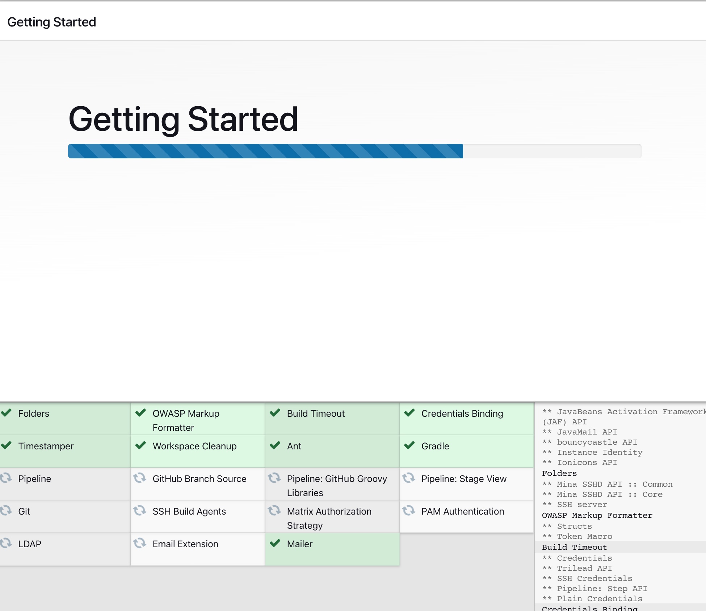
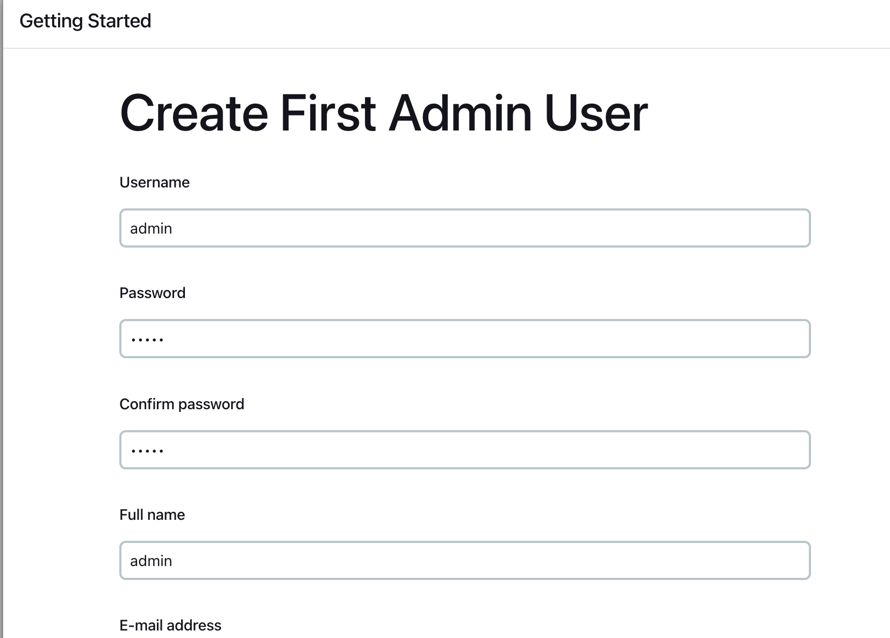
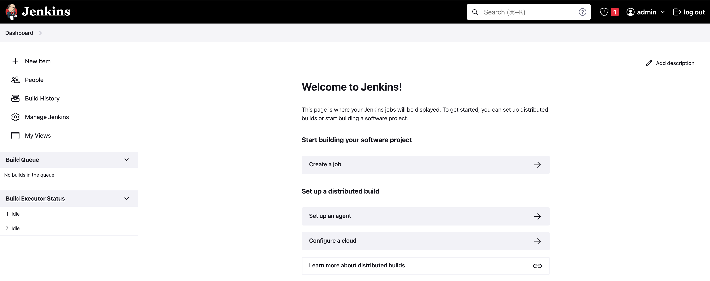
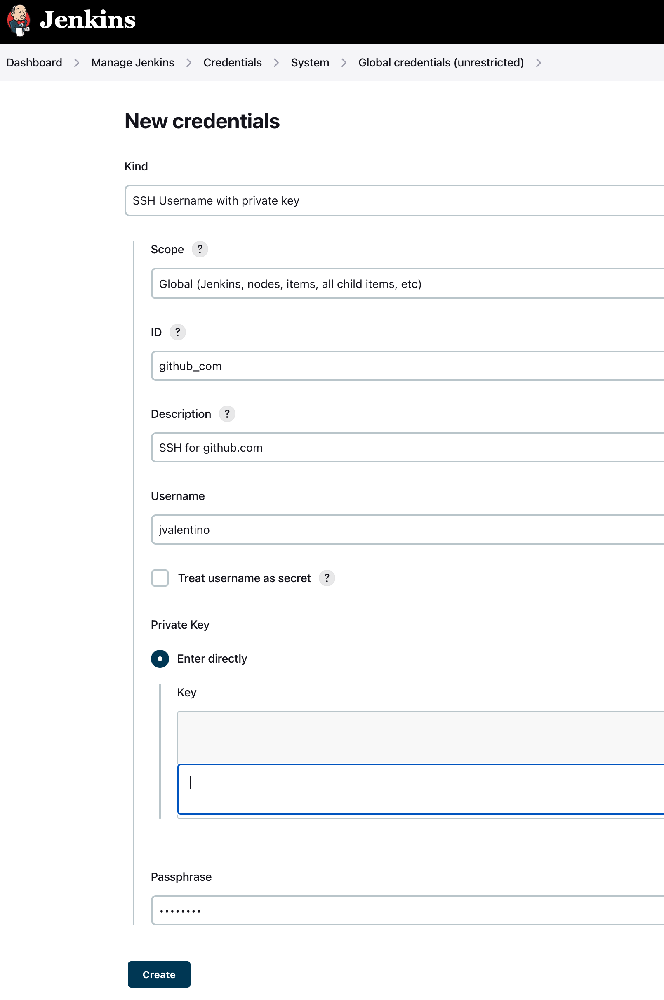
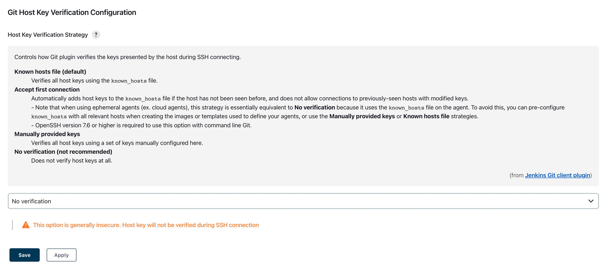
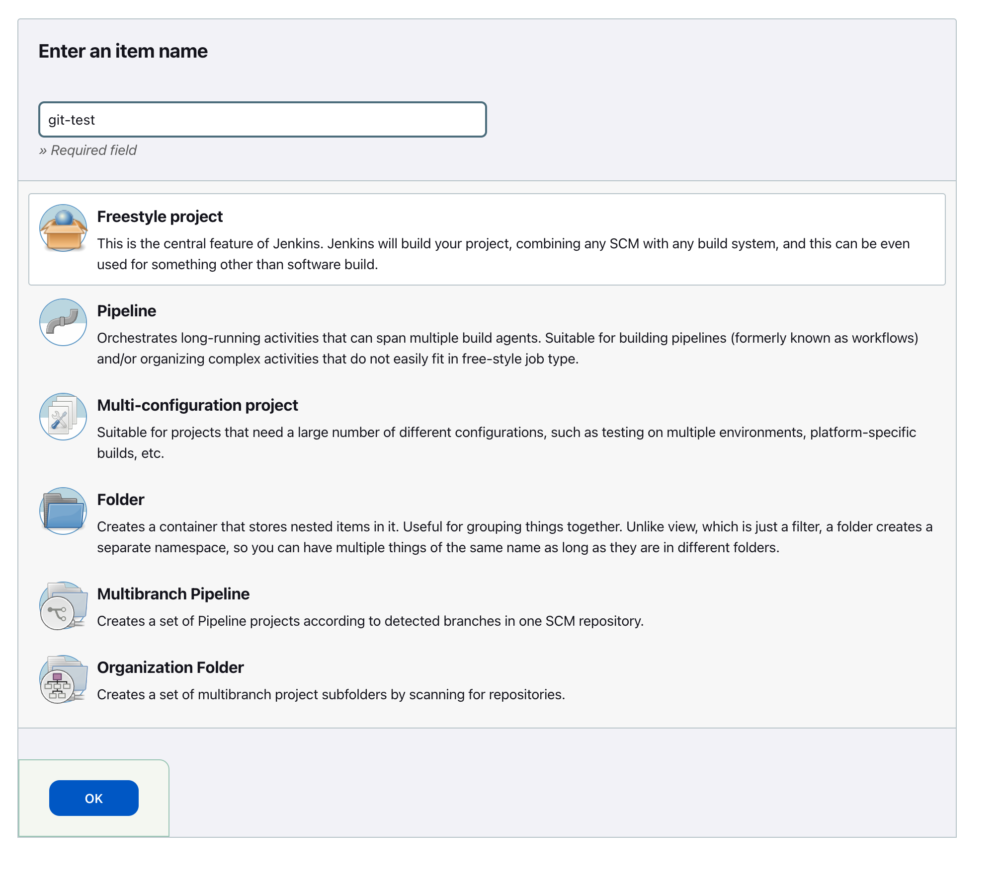
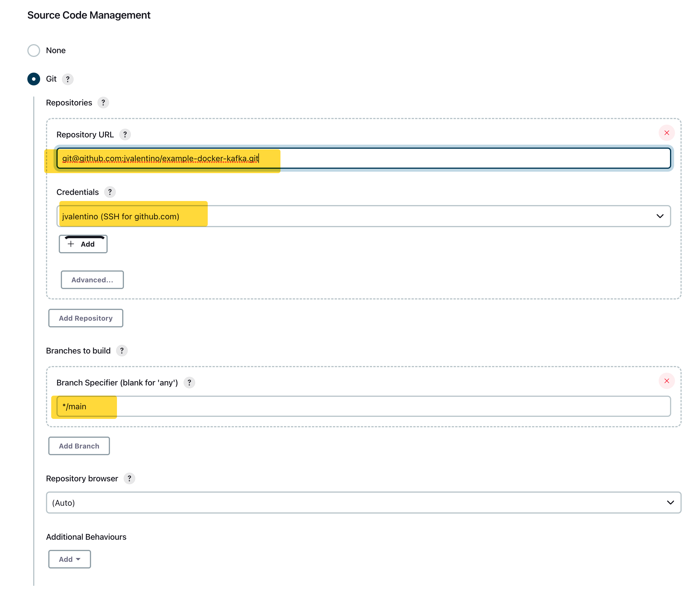
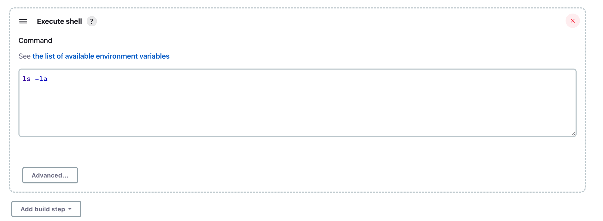
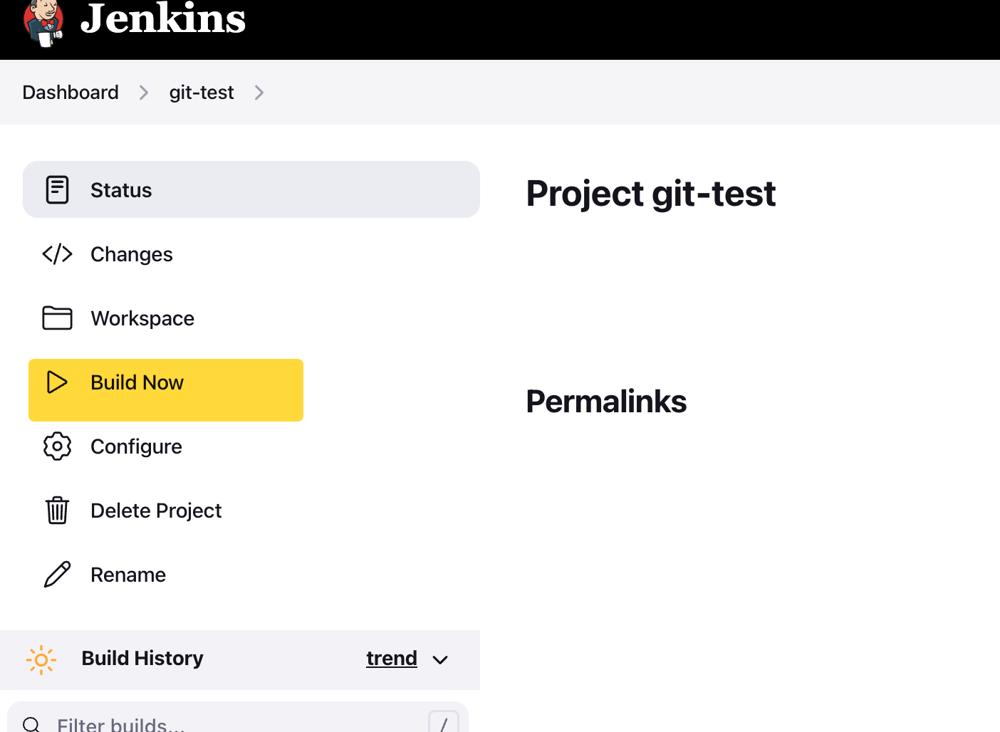
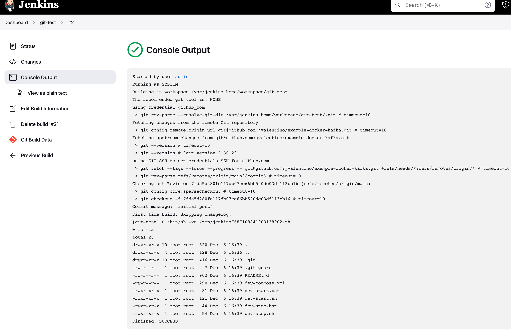

# Example Docker Jenkins

Prerequisites

- Having setup Git: https://github.com/jvalentino/setup-git
- Having setup Docker and Docker Compose: https://github.com/jvalentino/setup-docker

# One Time Setup

## (1) Initial Setup

### (1.1) Launch

Launch the container:

```bash
$ docker compose up -d
[+] Running 2/2
Network example-docker-jenkins_default  Created    
Container jenkins                       Started             
```

### (1.2) Password

Open the locaiton in the web browser at https://localhost:8080, which will prompt you to enter a password.

The easiest way to get that password is to run the following command and look for it in the logs:

```bash
$ docker logs jenkins
*************************************************************
*************************************************************
*************************************************************

Jenkins initial setup is required. An admin user has been created and a password generated.
Please use the following password to proceed to installation:

edaaa291fb234ef9998405c917aeb6bb

This may also be found at: /var/jenkins_home/secrets/initialAdminPassword

*************************************************************
*************************************************************
*************************************************************
```

You then copy and paste that password into the http://localhost:8080/

### (1.3) Configure

You now have to choose a starting configuration, where you select "Install Standard Plugins" via http://localhost:8080/, which will then spend several minutes downloading the internet:



### (1.4) Create the admin user



### (1.5) Complete the setup

You you finish the wizard, you will be directed to the main view:



## (2) Verifying you setup persistence correctly

The best way to verify you set it up correct, it so shut it down:

```bash
$ docker-compose down
```

...but what about my data?!

All of that configuration data was written to ./jenkins_home, which is then mounted to the container on startup via docker-compose.yml. As a result, when you launch again it will still have all its data:

```bash
$ docker-compose up -d
[+] Running 2/2
Network example-docker-jenkins_default  Created    
Container jenkins     
```

## (3) Connecting to Git

### (3.1) Creating a Git SSH Credential

Go to http://localhost:8080/manage/credentials/store/system/domain/_/newCredentials, and create a new credential for Git using its private key.



If you followed the instrucitons at https://github.com/jvalentino/setup-git, this would be the content of the file at `~/.ssh/github_com`

### (3.2) Configuring Global Security to allow connecting to Git

By default, Jenkins will not be able to do SSH with any URL, so you have to choose a host verification strategy.

Since we are doing this for example/testing purposes, we are doing to go to http://localhost:8080/manage/configureSecurity/ and set the option to "no verification".




### (3.3) Verifying the Git connection

We are going to create a freestyle job to verify that our Git Connection is working.

#### Create a new Freestyle job

Go to http://localhost:8080/view/all/newJob, select "Freestyle project", and press "OK".



#### Connect that job to Git using the credentials setup earlier

The first step is to use `git@github.com:jvalentino/example-docker-kafka.git` as a public facing test repository. Enter in the URL in the SSH Format of `git@github.com:jvalentino/setup-git.git`, and then select the credential we created earlier:



Also consider that we are using github.com, the main branch is `main` insrtead of master.

Warning!

If you receive the followinf error, you didn't configure the hostname strategy appropriate back in step 3.2:

```bash
Failed to connect to repository : Command "git ls-remote -h -- git@github.com:jvalentino/example-docker-kafka.git HEAD" returned status code 128:
stdout:
stderr: No ECDSA host key is known for github.com and you have requested strict checking.
Host key verification failed.
fatal: Could not read from remote repository.

Please make sure you have the correct access rights
and the repository exists.
```

We are then going to add a build step to just list the content of what we cloned:



Hit the "Save" button.

#### Run the job

You do this by pressing the "Build Now" button:



You now it worked if the job passes, and when you click on the console output you see this:




